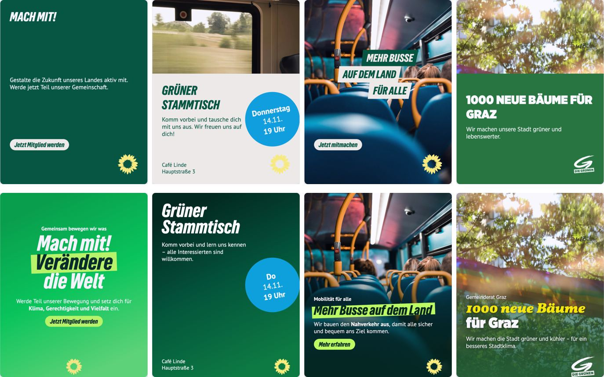
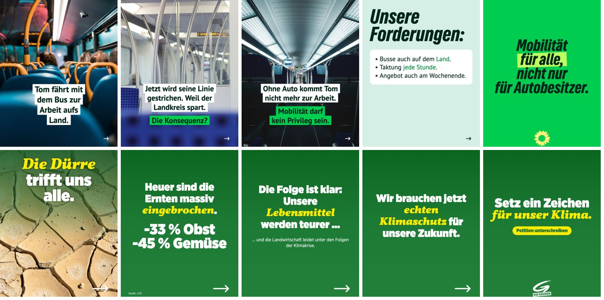

# Sharepic aus Freitext — Eval 02.10.2026

Experimenteller Creator unter `/studio/freitext`: Freitext rein, editierbarer `freeform`-Canvas raus. Dieser Bericht hält fest, wie der Entwurf entstand, was gemessen wurde und was offen ist.

## Aufbau

```
Freitext ─► POST /api/sharepic-creator/draft
             1. bedarf_melden (Gemma 4, Melious): Land, Beispiele, Kapitel, Foto-Suchbegriffe
             2. Server lädt nur das: Grundlagen + Kapitel + 1–2 Beispiele + Fototreffer
             3. entwurf_abgeben: SharepicSpec, validiert (Schema + Fotokatalog + keine erfundenen Adressen)
          ◄─ Spec
Client: composeSharepic(spec) → freeform-State → renderSharepicToImage (Editor-Renderer)
          ─► POST /api/sharepic-creator/review (Bild + Spec) → Gemma-Vision: issues + Patch-Ops
Client: applySharepicPatch → neu rendern (max. 2 Runden) → Vorschau → „Im Editor öffnen“ (canvas.create)
```

- **Die Schleife läuft im Client**, weil nur der Browser den editor-identischen Renderer hat (`renderSharepicToImage`). Der Server-Renderer (`simple_canvas`) kennt die meisten Editor-Elemente nicht.
- **Der Server importiert `canvas-editor` nicht**, denn das API-Docker-Image enthält das Paket nicht. Das Spec-Schema liegt in `contracts`, Composer und Patch liegen in `canvas-editor/composer` (pure, ein Import-Wächter im Test).
- **Wissen wird bei Bedarf geladen.** Im Prompt steht nur ein Katalog. Kapitel (`apps/api/prompts/sharepic-creator/kapitel/`) und Beispiele (`beispiele.json`) wählt das Modell im ersten Schritt. Das Rezept-Muster mit offener Tool-Schleife wurde verworfen: zwei feste `aiObject`-Aufrufe haben bekannte Kosten und keine Eigenheiten der Melious-Streams.
- **Hintergründe kommen aus den 35 vorhandenen Unsplash-Stockfotos** (`public/sharepic_example_bg`). Das kostet kein Geld. FLUX 3 ist als späterer Opt-in gedacht.
- **DE/AT wird automatisch erkannt.** Standard ist das Profil-Land; das Modell wechselt nur, wenn der Auftrag eindeutig in das andere Land gehört (gemessen: „Gemeinderat Graz“ → de-AT, „Kreistag Bayern“ → de-DE).

## Grundlage: die 20 neuesten Instagram-Posts je Land

Am 02.10.2026 per Apify (`apify~instagram-post-scraper`) abgerufen: @die_gruenen und @diegruenen, je 20 Posts, 79 Bilder. Zwei Subagents haben jedes Bild angesehen. Die Bilder liegen nicht im Repo; die daraus abgeleiteten Beispiele stehen in `beispiele.json`.

Was die Posts tatsächlich tun, und was das an unseren Annahmen korrigiert hat:

- **Format:** Feed 3:4 (1080×1440), Videos 9:16, kein 1:1. _Wir bleiben vorerst bei 4:5, weil der Editor nur `post-portrait` kennt._
- **Headlines:** Satzschreibung, keine Versalien. 10–17 % der Breite groß, füllen 80–90 % der Breite. DE in GrueneType kursiv, AT in Gotham Ultra.
- **Genau ein Akzent pro Slide.**
  - AT: ein gelbes Wort bzw. eine gelbe Zeile in Vollkorn Black Italic (17 Slides).
  - DE: Farbwort oder Marker-Box (Lime `#BEFF60`).
- **Ein kompakter Textblock** statt über die Fläche verteilter Elemente. Elemente überlappen bewusst (Person vor Headline, Karte auf Foto).
- **Keine Flachfarbe:** Grün-Verläufe mit Korn, Kopfband, weiße Karte, Duoton-Fotos.
- **Text auf Fotos:**
  - DE baut Kontrast immer auf (Verlauf, Box, Kontur).
  - AT nutzt einen weichen Schatten über ruhigen Bildzonen.
- **DE-Palette heute:** Dunkeltanne `#00261A`, Grasgrün `#00CC4F`, Lime, Mint `#D5EEE6`. Klee und Sand kommen kaum noch vor.
- **Nicht genutzt:** Die drei schrägen Versalien-Balken der Dreizeilen-Vorlage kommen in **keinem** DE-Post vor. Pill-CTA, Datumskreis und Icons tauchen praktisch nie auf.
- **AT-Eigenheiten:** weißer Pinsel-Pfeil auf 27 von 32 Karussell-Slides; Logo selten, dann zentriert.

## Messung: vorher/nachher

Vier feste Aufträge, je ein Lauf, gerendert mit dem Editor-Renderer:

1. „Sharepic zur Mitgliederwerbung: Mach mit bei den Grünen!“
2. „Einladung zum Grünen Stammtisch am Donnerstag, 14.11., 19 Uhr im Café Linde, Hauptstraße 3“
3. „Mehr Busse auf dem Land – wir bauen den Nahverkehr aus“
4. „Gemeinderat Graz: Wir pflanzen 1000 neue Bäume in der Stadt“



- **Vorher (v1):** freie Bausteine in Zonen (Balken, Headline, Pill, Störer …), Versalien, Klee/Sand-Palette. Ergebnis: Elemente über die ganze Fläche verteilt, kleine Schrift, Flachfarbe.
- **Nachher (v3):** eine Textgruppe (Dachzeile → Headline mit Akzentzeile → Text/Zitat/Liste → Button), Headline auf die Breite skaliert, Verlauf statt Flachfarbe, Verlauf über dem Foto auf der Textseite, Beispiele aus den echten Posts.

Beobachtet, nicht gemessen: Das ist eine Sichtprüfung an vier Fällen, kein blinder Vergleich. Im Einzelnen:

- **Fall 1:** von leerer Fläche zu kompaktem, großem Block auf Grasgrün-Verlauf.
- **Fall 2:** Die Prüfung erkannte das unpassende Foto (Zuginnenraum für einen Stammtisch) und ersetzte es per `use_color` durch Tanne.
- **Fall 3:** lesbar über Verlauf, Lime-Akzent. Die Prüfung verkürzte die Headline auf eine Zeile, das war eher schwächer. Daraufhin wurde ihr Prompt geschärft (1–3 Wörter je Zeile).
- **Fall 4 (AT):** Vollkorn-Akzent in Gelb, Gotham Ultra, AT-Logo.

Zwischenstand v2 → v3 (nach der ersten Messung behoben):

- **Die Prüfung erklärte CD-Elemente zum Fehler.** Sie hielt den Datumskreis für eine CD-Abweichung und machte die Fläche weiß. Jetzt nennt der Prompt die Elemente, die zum CD gehören.
- **Die Prüfung schickte denselben Patch zweimal**, und die Schleife zählte das als Korrektur. Jetzt gibt `applySharepicPatch` bei einem No-op dasselbe Objekt zurück, und die Schleife stoppt.
- **Es fehlte eine Op, um ein Foto zu ersetzen** → `use_color`.
- **Der Verlauf über dem Foto war zu schwach** → stärker.

## Kosten und Dauer

- Entwurf: zwei Gemma-Aufrufe, ~2–10 s.
- Prüfung: bis zu zwei Vision-Aufrufe, je ~3 s.
- Gesamt pro Sharepic: ~20–40 s im Browser, **ohne Bildkosten** (Stockfotos).

## Offen

- **Format 3:4** wie in den Posts. Braucht ein neues Canvas-Format im Editor.
- ~~AT-Akzent auf ein einzelnes Wort~~ — erledigt, siehe „Karussells“ (`==Wort==`).
- **Pinsel-Pfeil und Korn** gibt es noch nicht als Asset. Der Pfeil ist vorerst ein Tabler-Icon.
- **Nur 35 Stockfotos**, für manche Themen gibt es kein Motiv. Nächster Schritt: FLUX 3 als Opt-in mit dem Textbereich als ruhiger Box (siehe PR #4009).
- **Gemma-Vision liest Text gelegentlich falsch.** Sie meldete einmal einen Tippfehler, den es nicht gab. Ihre Prüfung ist eine Hilfe, kein Urteil.
- **„Im Editor öffnen“ ist lokal nicht durchgetestet.** Der Collab-Editor braucht Hocuspocus mit Session; `canvas.create` selbst lief (201).
- **`modelDiscovery.ts` führt Gemma auf Melious noch als `vision: false`** (#4008). Der Creator pinnt den Host direkt.

## Karussells (zweite Runde)

Kritik, Erklärung und Geschichten posten beide Parteien fast nur als Karussell. Ausgewertet wurden alle 20 Karussells unter den 40 Posts (116 Slides, zwei Subagents, je Land einer).

### Was die Karussells tun

- **Bogen:** Hook (4–10 Wörter) → Kontext/Zahl → Kritik oder Wendung („Doch …“, „anstatt …“) → Forderung → Schluss mit Logo. AT 4–6 Slides, DE-Geschichten bis 9.
- **Sätze laufen über die Slide-Grenze** (AT in 4 von 6 Text-Karussells). Brücken: „Deswegen …“, „Die Konsequenz?“, „Darum sagen wir:“.
- **AT:** gelbes Vollkorn-Wort mitten in der Zeile auf ~24 von 29 Slides; alle Slides auf demselben Grün; Fotostreifen unten, der ins Grün ausblendet; Logo nur auf der letzten Slide.
- **DE:** Geschichte auf wechselnden Detailfotos, jede Zeile in einer weißen Box, der Kernsatz in einer grünen; dann Forderungen auf Mint, Schluss-These mit mehreren Marker-Zeilen.
- **Selten bis nie:** Seitenzahlen (0×), Quellenzeile (1×), Diagramme (Raster, Torte; 2×), große Statistik-Slide (0×). Politikerfotos, Freisteller und Memes kommen vor, sind aber nicht nachbaubar.

### Was dafür gebaut wurde

- **Spec mit `slides` (1–8).** Ein Einzelbild ist ein Karussell mit einer Slide. Der Weiter-Pfeil gehört nicht zur Spec: jede Slide außer der letzten bekommt ihn. „Im Editor öffnen“ legt ein mehrseitiges `freeform`-Dokument an, je Seite mit eigener Foto-Attribution.
- **`==Wort==` als echte Auszeichnung im Editor** (`contracts/src/text/inlineMarks.ts`, Mark `accent`): Konva zeichnet und misst den Lauf in Akzentfarbe/-schrift (`AdditionalText.accent`), tiptap kennt die Mark immer (unbekannte Marks leeren sonst das Feld), die Werkzeugleiste bietet sie an, wo der Text einen Akzentstil hat.
- **Bausteine:** `absatz` (+ `betont`), `zeilenboxen` (nur DE, Pill-Badges je Zeile, ausgeglichener Umbruch), mehrzeiliger `akzent`, `quelle`, Hintergrund `foto-unten`.
- **Füllen statt verloren:** Absätze und Listen wachsen, bis der Block ~70 % der freien Höhe füllt; ein kurzer Hook in Zeilenboxen wird groß gesetzt; zentrierte AT-Absätze in schmalerer Spalte (82 %).
- **Prüfung im Code:** jede Zahl muss im Auftrag stehen; im Karussell stehen Zahlen in Headline oder Absatz, nicht im Kleintext (die Prompt-Regel allein ignorierte Gemma).
- **Editor-Fehler nebenbei behoben:** Icons aus einem anderen Set als dem Standard-Set zeichnete die Ebene nur, wenn das Set zufällig geladen war (nach dem Wiederöffnen fehlten sie, in der Vorschau immer). Die Ebene lädt jetzt die Sets ihrer Icons (`useIconSetsFor`), der Offscreen-Renderer vorab.

### Nachgemessen

Median über textfreie Flächen der Originale gegen unseren Render:

|                     | Original                             | vorher                    | jetzt                         |
| ------------------- | ------------------------------------ | ------------------------- | ----------------------------- |
| AT Farbfläche oben  | #0A631E … #126E28                    | #1B5E2C                   | #0C6721                       |
| AT Farbfläche unten | #1E7A35 … #28833E                    | #4FAA3A (gelbgrün)        | #23803B                       |
| DE Grasgrün         | #01CF51 flach                        | Verlauf #00A33F → #5BDC6E | #00CC4F flach, dunkle Schrift |
| DE Mint             | #D5EFE6                              | #D5EEE6                   | unverändert                   |
| AT-Logo             | ~245 px breit, ~100 px über dem Rand | 170 px, auf der Kante     | 240 px, 95 px über dem Rand   |

### Live mit Gemma

Zwei Aufträge durch die ganze Kette (Entwurf, Render, Prüfung), 10–19 s je Karussell, ohne Bildkosten:



- DE „Tom und der gestrichene Bus“: drei Fotos mit Zeilenboxen, „Die Konsequenz?“ grün, Forderungen auf Mint, Schluss-These mit Marker, Sonnenblume.
- AT „Dürre“: Hook auf Foto, „−33 % Obst / −45 % Gemüse“ groß, „Quelle: LKÖ“, gelbe Wort-Akzente, Petitions-Button, Logo am Schluss.

Sichtprüfung gegen die Originale, kein blinder Vergleich.

### Offen

- Stoff- bzw. Papiertextur und Korn (braucht ein Bild-Asset).
- Diagramme (Personenraster, Torte), Freisteller, Politikerfotos.
- Die Logo-Slide setzt ihren Text noch etwas kleiner als das Original, weil das größere Logo Platz nimmt.
- „Im Editor öffnen“ mit mehreren Seiten ist lokal nicht durchgeklickt (Collab-Editor braucht eine echte Session); Rendern und das Bearbeiten des Akzents sind per Tests belegt; die Seiten gehen im selben Format wie beim Slider-Deck mit (`initial_state.pages`), dafür gibt es keinen eigenen Test.
- Die Prüfung (Gemma Vision) will Absatz-Slides weiter gern zu Headlines machen und liest einzelne Wörter falsch; der Prompt nennt Absatz-Slides inzwischen ausdrücklich als gewollt.
